# Prism.Cinema – Movie Streaming Service Database & Application Project

## Overview

This project implements a complete backend data model and application architecture for an online movie streaming service. The system supports multiple user roles (guest, observer, subscriber, administrator), manages movie metadata, licensing, subscriptions, and user interactions, and is designed for scalability and maintainability.

The project was developed as an academic database and application engineering assignment and includes database design, implementation, testing, and an application-layer prototype.

---

## Project Goals

The primary objectives of the project are:

* Design and implement a relational database for a movie streaming platform
* Support user accounts, subscriptions, and role-based access control
* Store and manage detailed movie metadata, licenses, and localization data
* Ensure data integrity, performance, and scalability
* Provide a backend and frontend application architecture for interacting with the database

---

## Functional Requirements

* Guests can browse movie information
* Observers can register, log in, edit their profile, and delete their account
* Subscribers can watch movies and manage a list of favorite movies
* Administrators can manage movies, users, and access rights
* Role inheritance: Guest → Observer → Subscriber → Administrator

---

## Non‑Functional Requirements

* PostgreSQL relational database
* Backend implemented in Python (Flask)
* Frontend implemented in TypeScript (React)
* Docker-based deployment
* Secure administrator access
* Designed to handle up to 25,000 users
* External VoD solution for video streaming

---

## System Architecture

### High‑Level Architecture

The system follows a three-layer architecture:

1. **Presentation Layer**

   * React.js frontend
   * User interfaces for guests, subscribers, and administrators

2. **Application Layer**

   * Flask-based REST API
   * Business logic, authentication, and authorization

3. **Data Layer**

   * PostgreSQL relational database
   * Triggers, views, indexes, and constraints

---

## Database Design

### Conceptual Model

* Entity–Relationship Diagram (ERD) defines movies, users, licenses, subscriptions, and relationships
* Supports multiple many‑to‑many relationships (movies–actors, movies–genres, users–favorites)

### Logical Model

Key entities include:

* MOVIES
* USERS
* ACTORS
* DIRECTORS
* GENRES
* LICENSES
* SERVICE_SUBSCRIPTION_PLANS

### Physical Model

* UUID-based primary keys
* Foreign keys with cascade rules
* Indexes optimized for frequent queries
* PostgreSQL-specific data types (json, daterange, bytea)

---

## Database Schema Overview

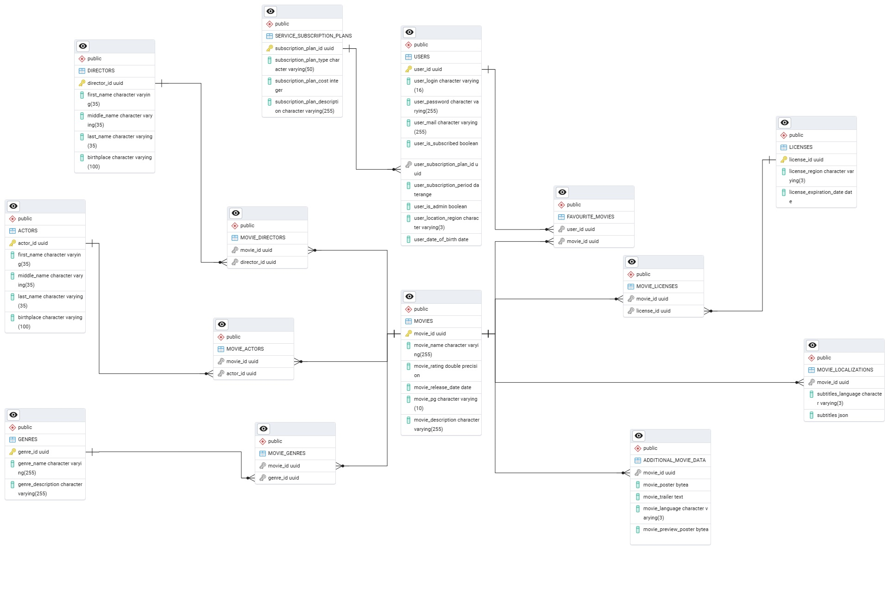

### Core Tables

* **MOVIES** – basic movie metadata
* **USERS** – user accounts and roles
* **ACTORS / DIRECTORS** – people involved in movies
* **GENRES** – movie genres
* **LICENSES** – regional licensing information
* **SERVICE_SUBSCRIPTION_PLANS** – subscription types

### Relationship Tables

* MOVIE_ACTORS
* MOVIE_DIRECTORS
* MOVIE_GENRES
* MOVIE_LICENSES
* FAVOURITE_MOVIES

### Additional Data Tables

* ADDITIONAL_MOVIE_DATA – posters, trailers, original language
* MOVIE_LOCALIZATIONS – subtitles and localization data

---

## Views

The database provides multiple views to simplify data access:

* **highest_rate_movies** – movies with rating above 8
* **movie_with_directors** – movies with aggregated director names
* **movie_language_info** – original language and subtitles
* **movies_with_actors** – movies with assigned actors
* **user_favourite_movies** – users and their favorite movies

---

## Triggers

* **check_movie_release_year** – prevents future release dates
* **cleanup_movie_dependencies** – removes dependent records after movie deletion
* **cleanup_user_dependencies** – removes favorite movies after user deletion

Triggers ensure referential integrity and automated cleanup.

---

## Indexing Strategy

Indexes are created to optimize:

* Searching by names, ratings, genres, and regions
* Join operations on many‑to‑many tables
* Authentication and user lookups

Each major table includes primary key indexes and additional composite or attribute-based indexes.

---

## Data Generation

Python scripts are provided to generate sample data:

* Movies and metadata
* Licenses and subscription plans
* Users, actors, directors, and genres

Database access is handled via **psycopg2**.

---

## Application Layer

### Backend

* Python + Flask
* RESTful API
* Database access and business logic
* Authentication and role-based authorization

### Frontend

* React.js + TypeScript
* Separate views for guests, subscribers, and administrators
* UI prototypes designed in Figma

---

## Testing

### Database Tests

* Table integrity tests
* Relationship and foreign key tests
* Trigger behavior tests
* View correctness tests
* Index performance tests

### Performance Tests

* Tested with datasets of 10, 100, 1,000, and 10,000 records
* Query execution time analysis

### Permission Tests

* Verification of role-based access control

---

## Deployment

### Technology Stack

* PostgreSQL
* Python (Flask)
* TypeScript (React)
* Docker

### Running the Application

* Docker containers for database, backend, and frontend
* Environment-agnostic deployment (Linux, Windows, macOS)

---

## Project Structure

```
prism-cinema/
├── db_backend/
├── db_database/
├── db_dummy_data_import/
├── db_front/
├── db_tests/
├── posters/
├── preview_posters/
├── .gitignore
├── LICENSE
├── README.md
└── docker-compose.yml

```

---

## Application Implementation

### User-Facing Application

The user application represents the presentation layer of the system and provides intuitive access to backend functionalities.

The user interface dynamically adapts available features based on the user’s authentication status and subscription type. Three main usage scenarios are supported:

- unauthenticated user,
- authenticated user with a free subscription plan,
- user with an active paid subscription.

The visual design was implemented based on previously prepared mockups and later adjusted to real technical constraints and usability (UX) principles, including responsiveness and readability across different screen resolutions.

The application supports user registration, authentication, and subscription management. Unauthenticated users can only preview movie information, while authenticated users gain access to additional features such as liking movies.

---

### Unauthenticated User

An unauthenticated user has access to basic views that allow exploration of the platform and its available movie content.

**Main application screen:**

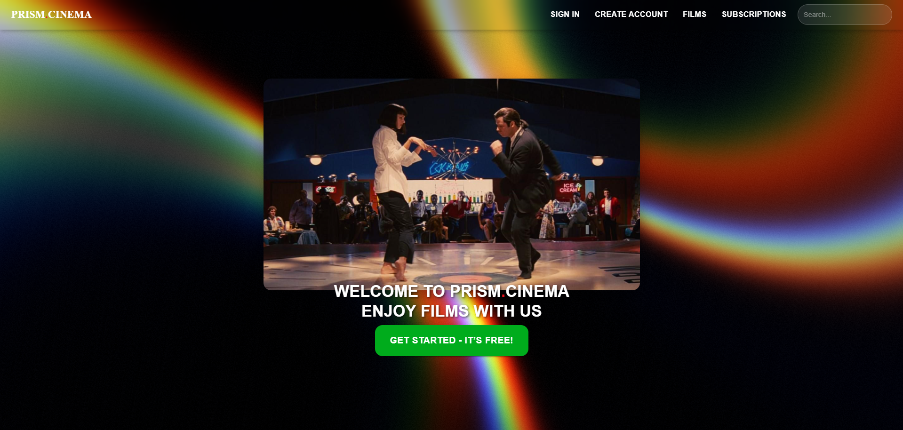

**List of available movies:**

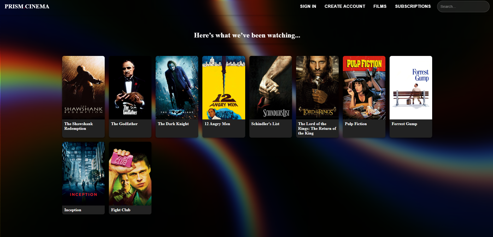

**Movie search view:**

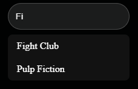

Unauthenticated users can view detailed movie information but cannot access interactive features.

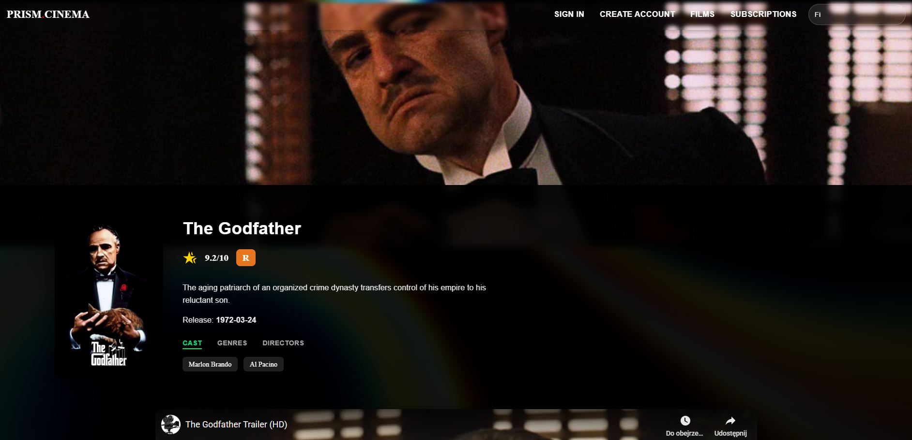

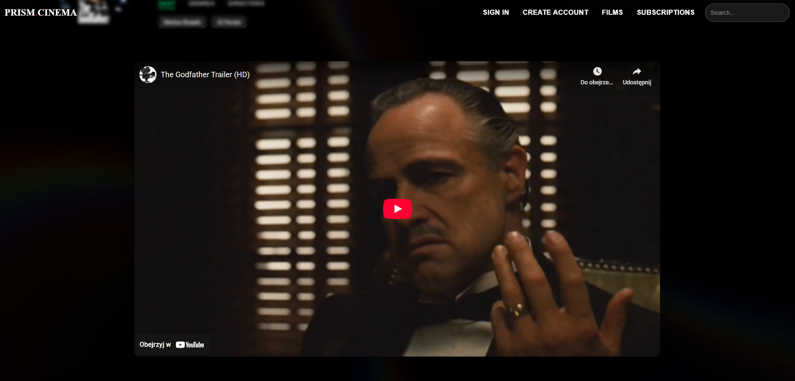

Additional movie-related information:

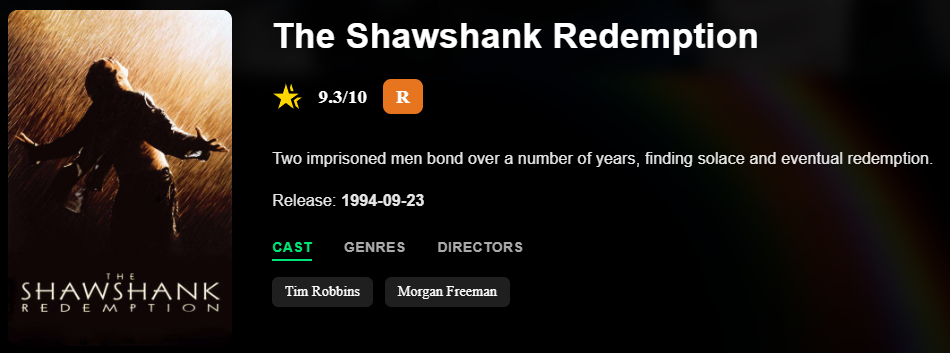

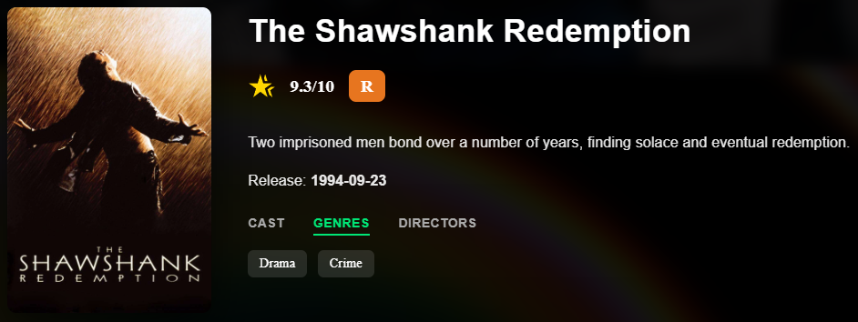

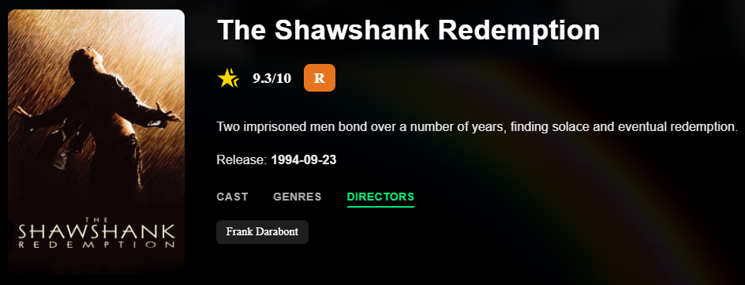

Detailed pages are also available for actors, directors, and genres:

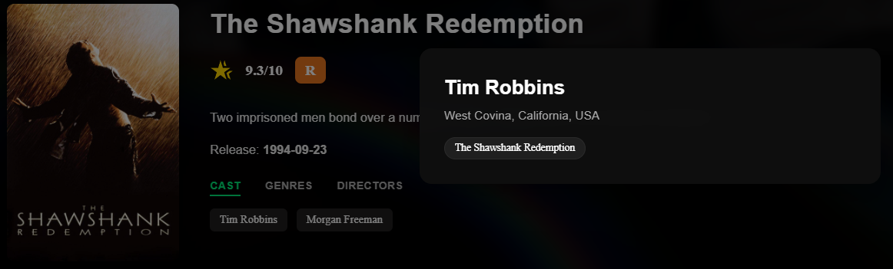

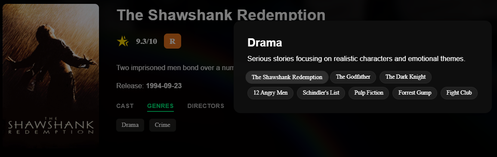

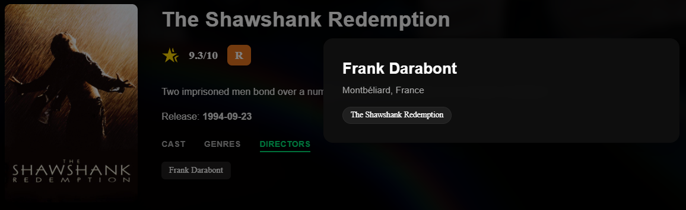

**Available subscription plans:**

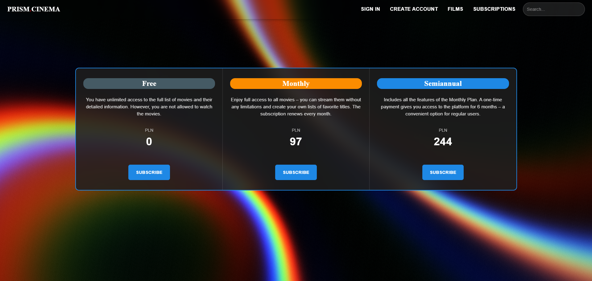

**Login panel:**


---

### Authenticated User with Free Subscription Plan

After logging in, a user with a free subscription plan gains access to the user dashboard and account management views.

**Application view after login:**

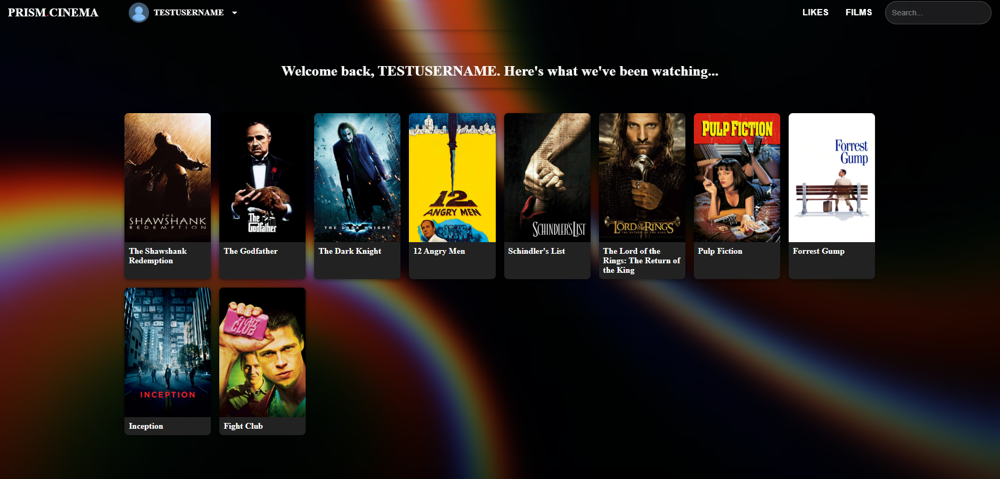

**Default free subscription plan:**

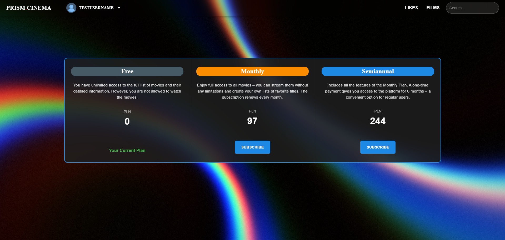

**User account menu:**

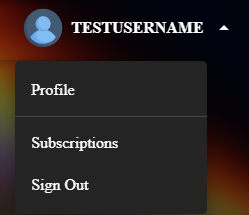

**User profile panel:**

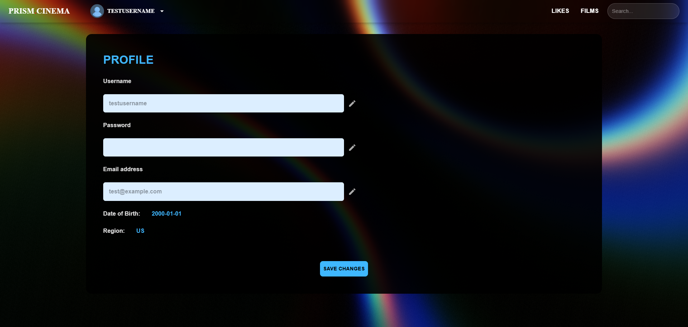

Users with a free subscription plan can browse movies but cannot like movies or play full content.

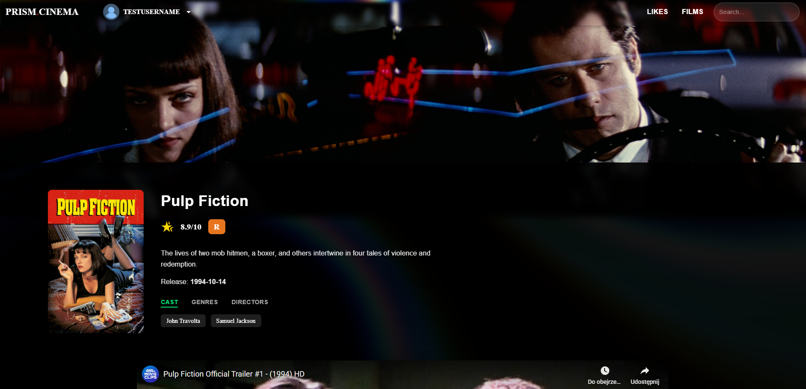

.png)

---

### User with Paid Subscription

Users with an active paid subscription have full access to platform functionalities.

**Movie page with liking enabled:**

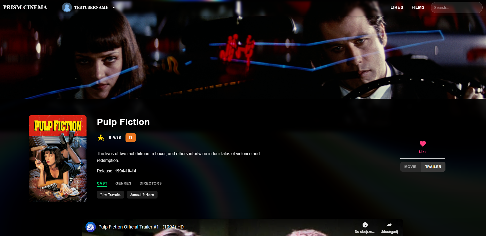

**List of liked movies:**

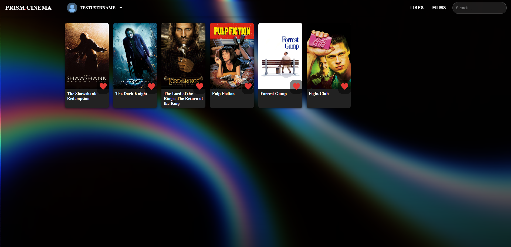

---

## Administrator Application

The administrator application extends system functionality and enables management of data stored in the database.

### Administrator Permissions

Administrators have access to features unavailable to standard users, including:

- adding new movies,
- editing existing movie records,
- deleting movies,
- deleting user accounts.

Access to administrative features is secured using token-based authorization.

---

### Administrator Interface

Below are selected views of the administrative panel used for managing system content.

**Adding a new movie:**

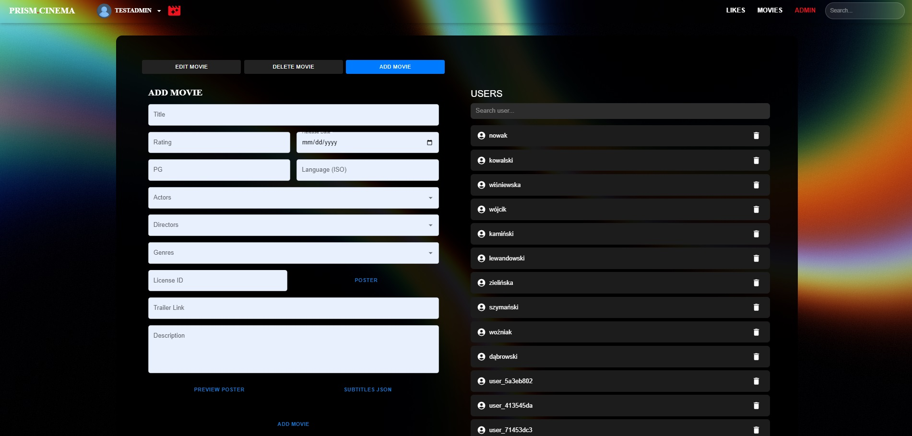

**Editing movie data:**

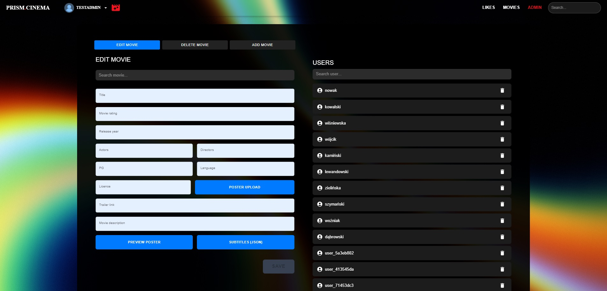

**Deleting a movie:**

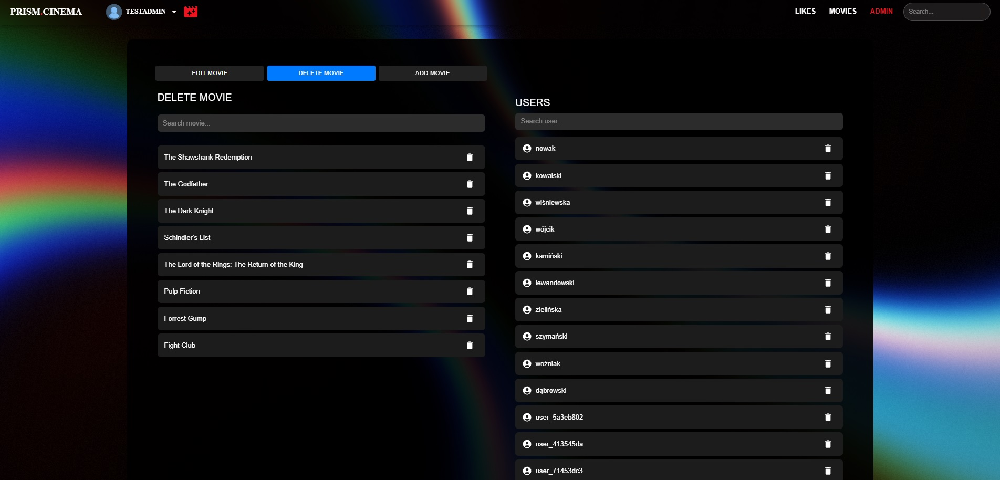


---

## Authors

* **Yevhen Skyba**
* **Andrii Kytrysh**

Computer Engineering students @ Wrocław University of Science and Technology

---

## Summary

This project demonstrates a full-cycle database and application design for a movie streaming service, combining strong relational modeling, performance optimization, and modern web application architecture. It serves as a solid foundation for further development into a production-ready system.
